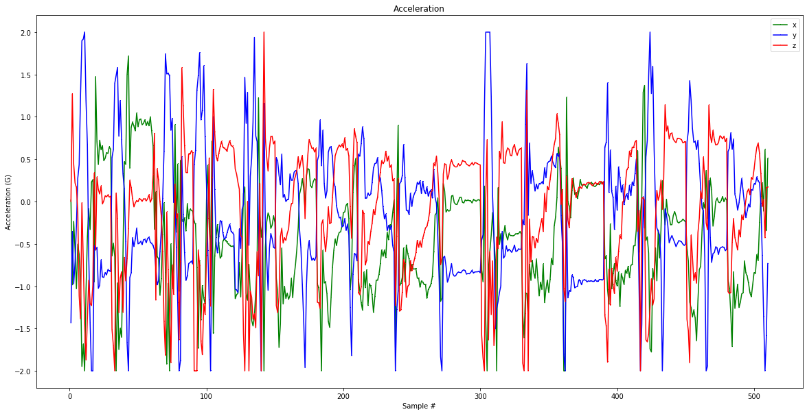
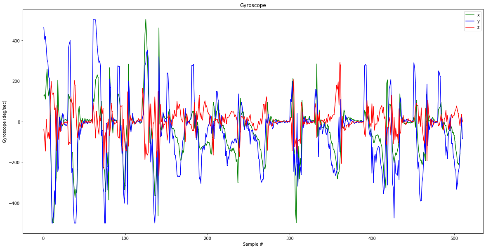
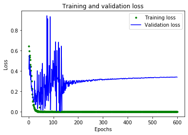
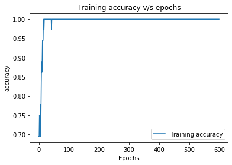
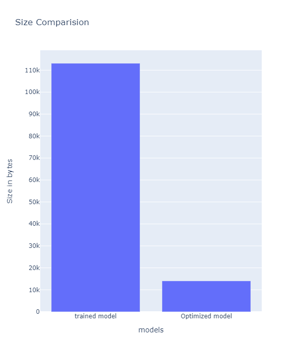
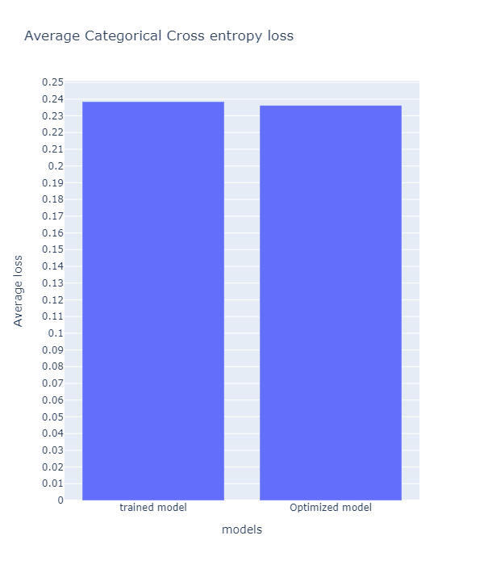

# Optimizing Neural Networks for Embedded Systems
The paper is available at https://irjet.net/archives/V7/i4/IRJET-V7I4211.pdf  
Deploying a system with deep neural network in cloud is highly limited as more latency is introduced since there is a round trip to server, privacy risks as the data needs to leave the device, connectivity as the data need to be sent to server, power consumption as network connections are power hungry. All these problems could be overcome by deploying the deep learning model in the edge devices like microcontroller, mobile devices. We achieve this by quantizing the trained neural network which reduces the size as well as increase the speed at the same time, the performance is not compensated.  
  
We train the neural network to identify the gestures based on sensor inputs, combination of accelerometer and gyroscope found to work well for training as well as gives good accuracy at test time. The trained network is then optimized by reducing the redundant computations which do not contribute much to the model accuracy also the pruning is done to reduce the floating-point precision. All these redundant computation and reduction in floating point precision is done based on the representative dataset which is similar to that of data given to the model at the test time so that the desired accuracy is maintained even after optimization.  
## EXPERIMENTAL SETUP
### Preparation of dataset
refer capture_data_acc_gyro folder for arduino code to capture data from the MPU6050. Covert the serially printed data into CSV and normalize the data in python environment.(Training.ipynp)

Aceelerometer data of 30 samples for a particular gesture

Gyroscope data of 30 samples for a particular gesture
### Training the Neural Network
TensorFlow keras is used for implementation and training of the neural network  
refer trainig.ipynb for preprocessing the and training the network   
The model was trained using ‘rmsprop’ optimizer for 600 epochs by which the validation loss was saturated to very low value. Categorical cross entropy is used as a loss function and the network is optimized based on that categorical cross entropy is SoftMax activation plus a cross entropy loss.   
The model was trained on Tesla K80 GPU which can do up to 8.73 Teraflops single-precision and up to 2.91 Teraflops double-precision performance with NVIDIA GPU Boost. This network gives a validation accuracy of 91.67 %.  
  
Variation of trainig loss(Categorical cross entropy) with epochs  
  
Variation of accuracy with epochs  
## Quantization
The trained model is of 113 kilo bytes which is very hard to fit into microcontrollers as ARM cortex M3 generally have 64 Kilo bytes of RAM. So, this model is quantized by reducing the floating-point precision of all the weights of the neural network from 64 bits to 16/32 bits.  
Pruning of parameters is done properly using the representative dataset during the model optimization i.e., reduce parameter count by structured pruning.   
  
 
## Deployment
refer Prediction and comparision of models.ipynb for deployment  
We ran the quantized model in the emulated environment to analyze its performance. We used Jupyter notebook configured with python 3.6 background. Serial communication between Jupyter notebook and the Arduino UNO is established using the Pyserial library in python.   
The data from the MPU6050 is received using Arduino UNO and it is transmitted serially to python environment where the model is running. After receiving the specified number of samples new line character is sent which indicates the end of samples required for classification. This data is fed to quantized neural network which performs classification in emulated environment and displays the output.
## Citation
Ranjith M S, S Parameshwara. Optimizing Neural Networks for Embedded Systems. IRJET Volume 7, Issue 4,  April 2020 S.NO: 211
